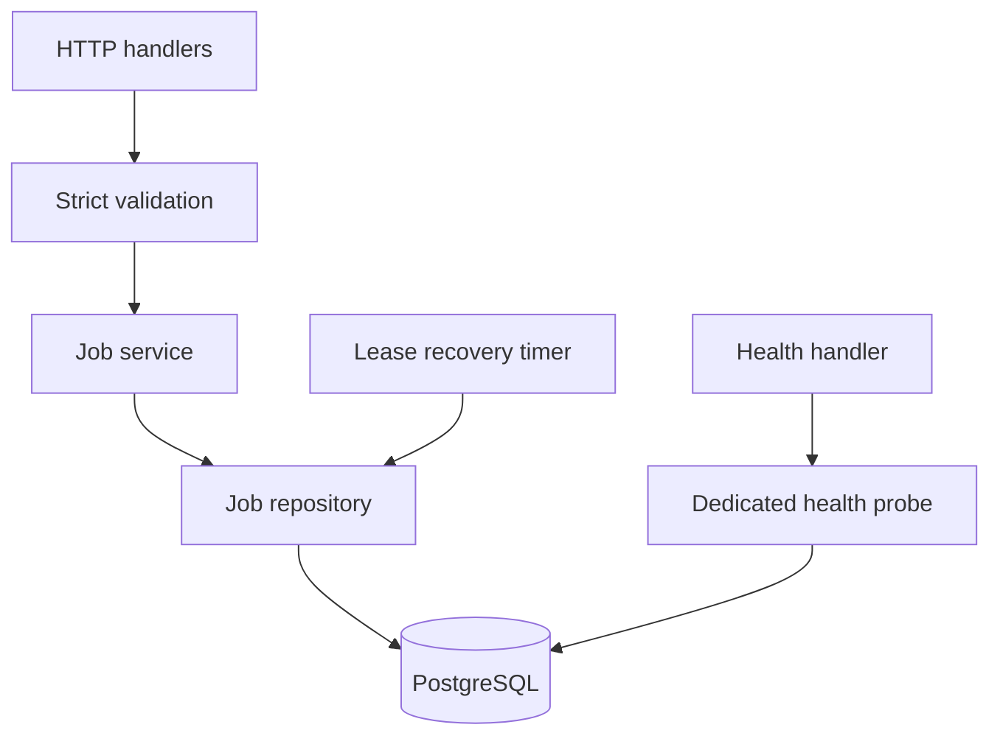
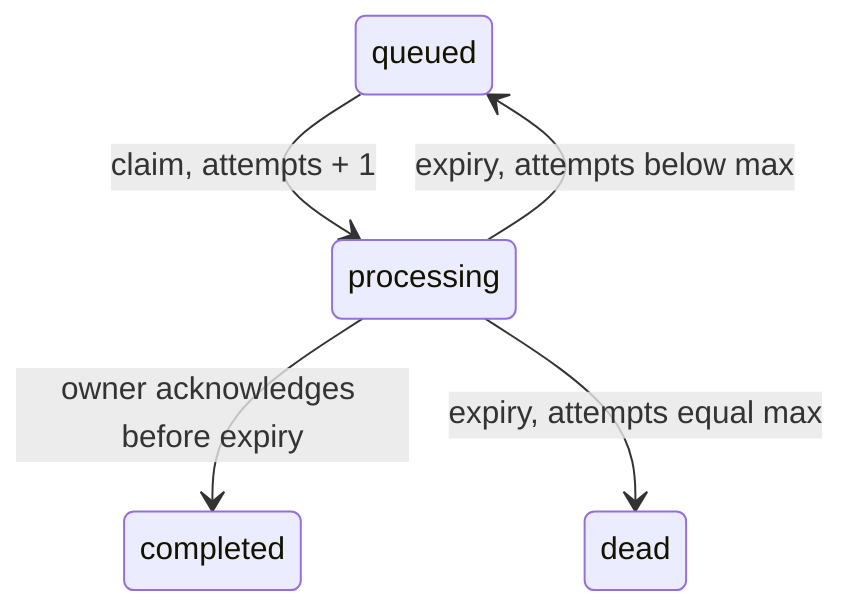

# Architecture and correctness decisions

PostgreSQL is the only authority for job data, attempts, ownership, and lease time. HTTP success follows statement/transaction commit. The only shared in-memory coordination is the health probe promise and a reaper timer; neither stores authoritative queue state.

## 1. Atomic claiming

**Problem:** Two workers can select the same queued job before either changes it.

**Decision:** Select an ordered batch using `FOR UPDATE SKIP LOCKED`, then update and return those same rows in a CTE, inside a short transaction. Increment attempts in the database and assign the lease with `clock_timestamp()`.

**Reason:** A candidate's row lock remains held until commit. Other workers skip that row; after commit it is `processing` and no longer matches the queued predicate. The database applies the limit. The response is sent only after commit. No work runs while the transaction holds locks. PostgreSQL explicitly describes SKIP LOCKED as useful for multiple consumers of a queue-like table. [PostgreSQL SELECT documentation](https://www.postgresql.org/docs/18/sql-select.html)

**Alternative considered:** Select then update without locks, a global application mutex, or serializable transactions with retries.

**Tradeoff:** Ordering by creation time and UUID gives best-effort FIFO, not strict FIFO under contention. Locked older rows can be skipped. Independent processes are safe because ownership is enforced by PostgreSQL rather than a process-local mutex.

## 2. Expiry and retry limits

**Problem:** A vanished worker cannot explicitly release its lease; terminal historical rows should not slow recovery.

**Decision:** Before claiming, recover at most 1,000 globally expired processing jobs with another SKIP LOCKED query. Processing jobs with attempts below the maximum become queued; exhausted jobs become dead. Clear worker/lease fields on both transitions. A timer runs the same recovery query once per second after completion of the preceding sweep.

**Reason:** Database time is consistent across API hosts. Recovery runs even without clients. Bounded batches limit locks and transaction size. Multiple reapers safely skip each other's rows. The claim's recovery UPDATE and claim UPDATE are separate statements in one transaction so selection sees recovery's changes.

**Alternative considered:** Unbounded recovery UPDATE, a separate scheduler deployment, or treating expired processing rows as claimable in a single broad OR query.

**Tradeoff:** A large backlog requires multiple sweeps. One claim can return empty before all expired jobs in its queue have been recovered. Timers are best-effort; recovery resumes after application/database restart. Global recovery avoids a second expiry index for each queue query.

## 3. Acknowledgement ownership and time

**Problem:** An acknowledgement can race recovery, another acknowledgement, or the lease deadline itself.

**Decision:** Lock the job row, distinguish missing/current/terminal state, then perform a conditional update using database wall-clock time after acquiring the lock. Keep the completing worker ID but clear the lease. Repeated acknowledgement by that worker returns success without another UPDATE; all other owners get a domain ownership error.

**Reason:** The row lock serializes acknowledgement and recovery. Evaluating time before a potentially long lock wait would accept an expired lease. A custom trigger error also maps to an ownership conflict if time crosses the deadline between the predicate and trigger evaluation.

**Alternative considered:** Read then update without a transaction, trust the client clock, or accept acknowledgements after expiry until recovery runs.

**Tradeoff:** Requests can wait for locks (bounded by the database lock timeout). A single `worker_id` cannot fence stale requests from a reused identity. The contract would need a per-claim token to solve that ambiguity; the current API does not silently add one. Ownership labels also do not authenticate clients.

## 4. Idempotent enqueue and commit boundaries

**Problem:** Concurrent retries must create only one logical job without rewriting the winning payload.

**Decision:** A unique nullable index on `idempotency_key` arbitrates concurrent insertion. Use INSERT ON CONFLICT DO NOTHING RETURNING, then SELECT the original job in a new statement if the insert lost. Idempotency keys are global and never expire in this API. The first committed valid input wins, even if a later valid request differs.

**Reason:** The conflict check waits for a competing insert's outcome. A subsequent READ COMMITTED statement gets a fresh snapshot and sees the winner. Combining the fallback SELECT in the same statement can miss a row whose concurrent insertion prevented the insert but was invisible to the original statement's snapshot. No no-op UPDATE is needed on a replay. [PostgreSQL transaction isolation](https://www.postgresql.org/docs/current/transaction-iso.html)

**Alternative considered:** Check-before-insert, an in-memory key cache, conflict-time no-op UPDATE, or rejecting changed inputs with an additional conflict response.

**Tradeoff:** Replays require a second round trip and return current metadata, not a frozen copy of the initial response. Rows/keys must remain stored for indefinite deduplication. Nullable keys allow independent submissions without deduplication. A lost response after commit is still a committed job; clients needing safe retries should supply a key.

**Durability:** The application uses `synchronous_commit=on`; PostgreSQL's normal fsync/WAL behavior and persistent Compose volume are retained. Enqueue awaits its autocommitted INSERT; claim and acknowledgement await transaction commit. UUID primary keys are generated by PostgreSQL without a new package or application counter. [PostgreSQL INSERT documentation](https://www.postgresql.org/docs/current/sql-insert.html)

## 5. Database invariants

**Problem:** Application-only checks can be accidentally bypassed by later repository changes.

**Decision:** CHECK constraints validate queue/key/worker lengths, payload object shape, attempts, and state/lease consistency. An UPDATE trigger protects immutable submission fields, legal transitions, terminal states, attempts increasing exactly once on claim, and active leases. Application repositories still include ownership/time predicates and locks.

**Reason:** CHECK constraints see one row snapshot; they cannot compare old and new attempts/status. The trigger supplies that comparison and causes invalid writes to roll back.

**Alternative considered:** All checks in services, or putting the entire API in stored procedures.

**Tradeoff:** Invariants span the typed schema and a custom SQL migration, so both need integration tests. Inserts may seed any internally valid historical state for restore/benchmark purposes; ordinary API insertion always uses queued/zero attempts. Database administrators with direct privileges can delete data or disable triggers; this design does not try to protect against privileged administration.

Legal transitions:

The last allowed attempt can succeed. Merely reaching max attempts at claim time does not kill an active lease. Completed and dead rows are terminal, and attempt counts never decrease.

## 6. Indexes

| Production index | Query and purpose | Write/storage cost | If removed |
|---|---|---|---|
| `jobs_pkey` (UUID) | Acknowledgement lookup, UPDATE joins, unique IDs | One B-tree entry per job; random UUID insertion has locality costs | No primary-key uniqueness; ID lookups and update joins degrade |
| `jobs_idempotency_key_idx` (unique nullable key) | Enqueue conflict arbitration and replay lookup | One entry per row, including null keys; unique-key checks on insertion | Concurrent submissions can create multiple logical jobs |
| `jobs_queued_idx` (queue, created_at, id), queued only | Ordered, bounded candidate selection without visiting completed/dead history | Entry on enqueue/recovery; removed on claim; maintenance prevents HOT updates for state changes | Million-row queue selection can scan/filter/sort substantial history |
| `jobs_expired_idx` (lease_expires_at, id), processing only | Ordered global expiry batches | Entry on claim; removed on completion/recovery; proportional to processing jobs | Reapers must search historical rows to find expired work |

There is no payload index and no index on every status/worker column. The exact claim query is benchmarked with and without the queued index. Important plans and measured timings appear in BENCHMARKS.md and benchmarks/latest.json. Index maintenance and terminal-history growth remain operational costs; no retention policy is part of this contract.

## 7. Validation and payload representation

**Problem:** Coercion or silent conversion can accept invalid limits or change worker payload values.

**Decision:** Validate unknown input at the HTTP boundary with explicit field allowlists, required fields, integer bounds, object-only payloads, and supported JSON values. Preserve strings without trimming. Reject values PostgreSQL JSONB cannot represent and unsafe integer inputs. Limit body size and recursion depth.

**Reason:** Database constraints are a final guard, not a substitute for predictable 400 responses. JSONB represents structured JSON values rather than source text. Repository parameters use Drizzle bindings, including dynamic values in raw SQL fragments.

**Alternative considered:** Implicit casting, storing unvalidated request objects, adding a schema-validation dependency, or storing raw JSON source text.

**Tradeoff:** A small hand-written validator is sufficient for three request types but needs boundary tests. JavaScript parsing uses double-precision numbers; clients needing exact arbitrary-precision values must send strings. JSON whitespace, key ordering, and duplicate keys are not preserved.

## 8. Layering and database lifecycle

**Problem:** HTTP concerns, SQL, and application startup become hard to test when coupled to global imports.

**Decision:** Factories construct database → repository → service → handlers/app. The app does not listen during import. The server owns listening, the recovery timer, and graceful shutdown. Repositories throw domain errors or return data; the HTTP error middleware maps them to responses.

**Reason:** Tests can run two independent application pools against the same PostgreSQL instance and issue real concurrent HTTP requests. Factories do not introduce an alternative in-memory queue. Services project responses; atomic business invariants remain close to their SQL operations.

**Alternative considered:** Global database singleton and importing a server that listens immediately, or adding a dependency-injection framework.

**Tradeoff:** A few explicit factory arguments are required. The fixed application pool has ten connections per API process; operators must account for replica count plus health connections. Statements/locks have database timeouts. The health endpoint retains an independent 500 ms deadline and always cleans up its dedicated connection. Shutdown stops accepting requests, drains them, stops recovery, and closes the pool, with a final 15-second process deadline.

## 9. Migration and deployment order

**Problem:** An API replica can start before the schema exists, or several replicas can migrate concurrently.

**Decision:** Versioned Drizzle migrations run before the API. A one-connection migration runner takes a PostgreSQL session advisory lock. Compose waits for the one-shot migration service to complete. The runtime image contains compiled JavaScript, production dependencies, and migrations, and runs as the Node user.

**Reason:** Migrations are reproducible and serialized; releasing the connection releases the lock after success or failure. Compose stores PostgreSQL data outside its container filesystem. The local migration runner is also usable without Docker. [Drizzle migrations](https://orm.drizzle.team/docs/migrations)

**Alternative considered:** Schema push on each request, automatic uncoordinated migration in every server process, or manually creating tables.

**Tradeoff:** Local users must run build/migrate before start. A schema and custom trigger migration need review together. Container configuration is supplied, but container execution was not validated in the current WSL environment; integration and performance measurements used real local PostgreSQL.

## 10. Delivery guarantees and remaining operational scope

**Problem:** A worker can finish an external side effect and crash before acknowledging it.

**Decision:** Provide at-least-once processing through leases and retries. External consumers must make side effects idempotent. No background executor, Redis, extra CRUD endpoint, lease renewal, per-lease fencing token, or dead-job administration API is included.

**Reason:** An HTTP queue acknowledgement cannot atomically commit arbitrary work in another system. The required four-endpoint contract does not define these extra capabilities.

**Alternative considered:** Claiming exactly-once external effects, or expanding the API to coordinate arbitrary worker transactions.

**Tradeoff:** Duplicate external work remains possible after lease expiry. Processing longer than 300 seconds cannot be protected by this contract's lease API. Authentication, authorization, rate limiting, TLS termination, backups, retention, and production capacity planning require deployment-specific decisions. The included tests demonstrate the specified queue invariants; benchmarks are measured examples, not a capacity SLA.
